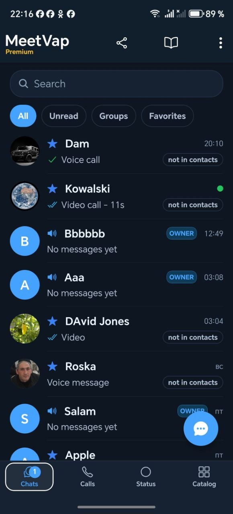
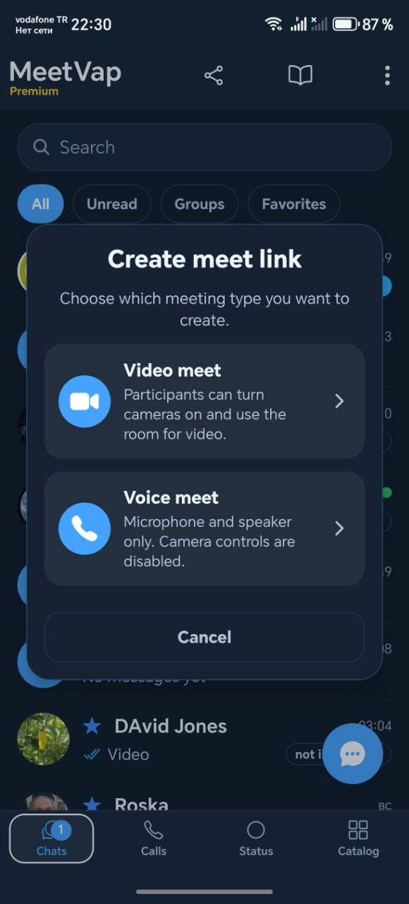
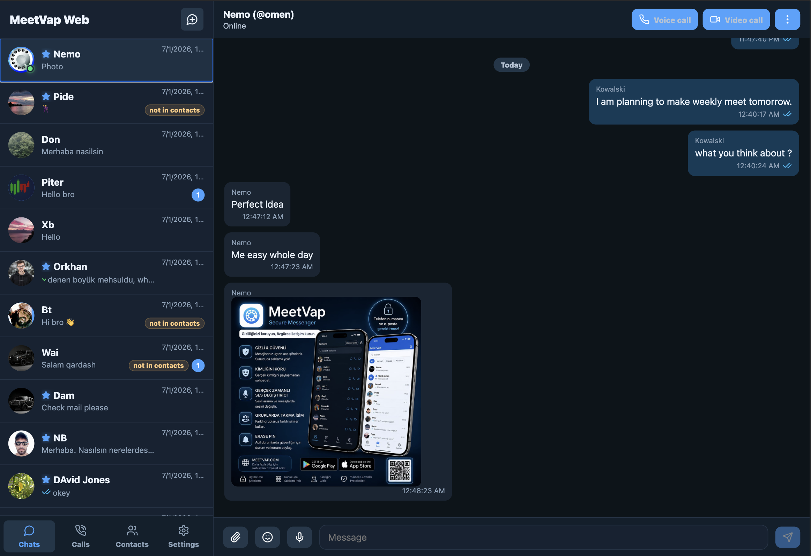
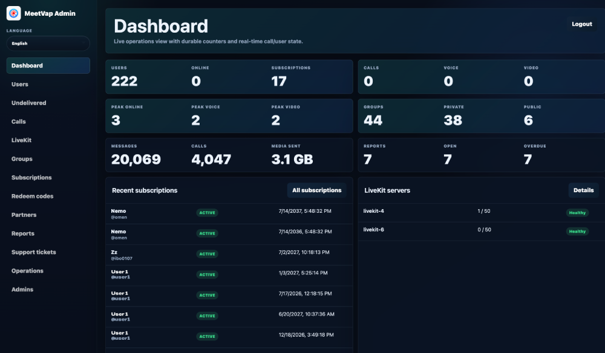
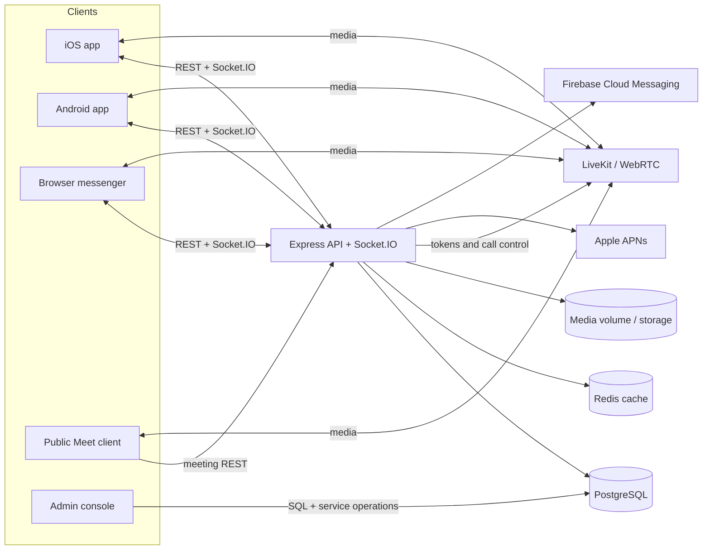
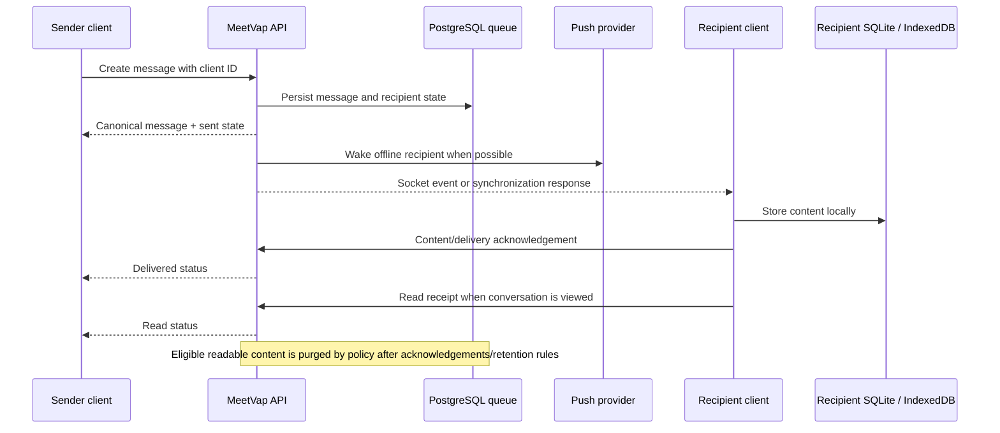

# MeetVap

<div align="center">
  

  **Private, local-first messaging and real-time communication across mobile and the web.**

  MeetVap is an open-source communication platform with native iOS and Android clients, a browser messenger, voice and video calling, moderated groups, stories, public meeting links, and an operator administration console.

  <h2>Solo-built with OpenAI Codex</h2>
  <p>Development began with GPT-5.5 and later transitioned to GPT-5.6. This project explains how Codex and GPT-5.6 were used for repository analysis, architecture, implementation, debugging, code review, and release preparation, while the solo developer directed the product and validated it on real devices.</p>

  <h3>Download and test the published apps</h3>
  <p>MeetVap is a working product available through both official mobile stores.</p>

  <a href="https://apps.apple.com/tr/app/meetvap/id6767963508"></a>
  <a href="https://play.google.com/store/apps/details?id=com.meetvap.messenger"></a>

  [](LICENSE)
  
  
  
  

  [Product guide](MeetVap.md) · [Architecture](#architecture) · [Quick start](#quick-start) · [Contributing](CONTRIBUTING.md) · [Security](SECURITY.md) · [Roadmap](ROADMAP.md)
</div>

> [!IMPORTANT]
> MeetVap is local-first, not serverless. PostgreSQL, Redis, object/file storage, push credentials, and LiveKit are still required for a production deployment. The server temporarily retains undelivered content according to operator policy.

## Contents

- [Why MeetVap](#why-meetvap)
- [Key features](#key-features)
- [Screenshots](#screenshots)
- [Architecture](#architecture)
- [Technology stack](#technology-stack)
- [Repository structure](#repository-structure)
- [Quick start](#quick-start)
- [Installation](#installation)
- [Configuration](#configuration)
- [Security and privacy](#security-and-privacy)
- [Mini Apps](#mini-apps)
- [Enterprise deployment](#enterprise-deployment)
- [API overview](#api-overview)
- [Development](#development)
- [Roadmap](#roadmap)
- [FAQ](#faq)
- [Contributing](#contributing)
- [License](#license)
- [Acknowledgements](#acknowledgements)

## Why MeetVap

Most communication systems make the service database the permanent source of readable conversation history. MeetVap takes a different approach: ordinary message history is primarily stored on each user's device, while the backend coordinates delivery, acknowledgements, edits, deletions, media transfer, calls, groups, and recovery.

That model does not remove the need for a server. It changes the server's responsibility. Content is queued while delivery is incomplete, clients acknowledge what they have stored, and maintenance jobs purge eligible readable content according to configured retention rules. The result is a messenger designed around delivery rather than an indefinite central archive.

MeetVap also brings the operational pieces into one repository: mobile and browser clients, public meetings, administration, moderation, subscription handling, push delivery, and sample web content. This makes the complete system inspectable and self-hostable instead of exposing only a client or a thin integration layer.

## Key features

### Messaging

Private and group conversations support text, images, video, files, voice messages, contacts, current location, and live location. Replies, edits, forwarding, reactions, pinned messages, delivery/read receipts, scheduled messages, disappearing messages, gallery views, resumable transfers, and offline queues are implemented across the messaging stack.

Mobile clients keep conversation history in SQLite and render recent local messages before network synchronization. The browser client uses browser storage, including IndexedDB-backed media caching, then reconciles new events with the backend.

### Voice and video

LiveKit powers private and group voice/video calls, voice rooms, public Meet links, and screen sharing. The clients include camera and microphone controls, audio routing, participant invitations, connection recovery, picture-in-picture support where available, native incoming-call integration, and network-adaptive publication/subscription behavior.

Meet links can be joined from the dedicated browser client without installing the mobile application. Mobile calling integrates with Android notifications and full-screen call surfaces, plus iOS PushKit and CallKit.

### Groups and stories

Groups provide pending invitations, owner/admin/member roles, aliases, public links, member-list policies, admin-only posting, protected media controls, screenshot restrictions, webhooks, and ownership transfer. Voice rooms use the same group identity and membership model while providing persistent push-to-talk communication.

Stories (called statuses in parts of the codebase) support image and video posts, captions, audience selection, view tracking, replies, playback navigation, and automatic 24-hour expiration with server-side cleanup.

### Privacy and safety

Users can control search visibility, nickname visibility, presence, private-chat screenshot behavior, group aliases, and whether callers must already be contacts. Blocking, reporting, moderation filters, protected groups, a permanent support conversation, Lock PIN, and PANIC PIN emergency workflows are built into the product.

Privacy controls are enforced at API and client boundaries where applicable. Platform screenshot protections remain subject to operating-system capabilities and cannot prevent external cameras or modified devices.

### Accounts and subscriptions

MeetVap supports username/password registration, public display names, multi-device sessions, Apple and Google subscription verification, redeem codes, trial policy, account deletion, and configurable minimum/latest app versions. Login usernames can remain hidden while display names are used as the public identity.

### Administration

The administration console covers users, subscriptions, calls, groups, reports, support conversations, devices, sessions, diagnostics, operational policy, catalog overrides, service health, and role-scoped admin accounts. A configuration-backed superadmin remains available for initial control.

### Developer and operator surfaces

The TypeScript API exposes REST endpoints and Socket.IO events for mobile and browser clients. Group webhooks can inject authorized text messages. Operational limits, retention, attestation rollout, application versions, Catalog URLs, and cleanup behavior are centrally configurable.

### Mini Apps and Catalog

The current Catalog is a server-selected WebView destination. Operators can configure a default URL or override it per user, and the repository includes lightweight PHP games as examples. It is intentionally simpler than a package SDK: there is no manifest format, permission API, or third-party sandbox yet.

## Screenshots

<table>
  <tr>
    <td align="center"><strong>Chat</strong><br></td>
    <td align="center"><strong>Groups</strong><br></td>
    <td align="center"><strong>Calls</strong><br></td>
  </tr>
  <tr>
    <td align="center"><strong>MeetLinks (Like Zoom links)</strong><br></td>
    <td align="center"><strong>Settings</strong><br></td>
    <td align="center"><strong>More product views</strong><br><a href="MeetVap.md">Read the product guide</a></td>
  </tr>
    <tr>
    <td align="center"><strong>Web version</strong><br></td>
    <td align="center"><strong>Admin panel</strong><br></td>

  </tr>
</table>

## Architecture

### System topology



### Message delivery



### Authentication and authorization

Passwords are hashed with bcrypt. Successful login creates a JWT and a server-side session record containing a token hash and device metadata. Authenticated requests resolve the session and user, while route-level checks enforce conversation membership, group roles, subscription rules, administrative permissions, and blocking/privacy constraints.

Optional mobile attestation supports Android Play Integrity and Apple App Attest with observe, soft-enforcement, and enforcement rollout modes. Redis accelerates selected session, policy, token, and administrative lookups; PostgreSQL remains the durable source of truth.

## Technology stack

| Layer | Technology |
| --- | --- |
| Mobile | React Native 0.83, Expo 55, React 19, TypeScript, Hermes, React Navigation, Zustand |
| Mobile storage | Expo SQLite, AsyncStorage, SecureStore, local filesystem caches |
| Native Android | Kotlin/Java, Gradle 9, Firebase Messaging, Android call/notification services |
| Native iOS | Swift/Objective-C, CocoaPods, CallKit, PushKit, ReplayKit extensions |
| Browser messenger | React 19, Vite 7, TypeScript, IndexedDB/browser storage, Lucide icons |
| Public meetings | React 19, Vite 7, LiveKit client |
| Backend | Node.js 22, Express 4, TypeScript, Socket.IO, Zod |
| Data | PostgreSQL, Prisma 6, Redis |
| Realtime media | LiveKit, WebRTC, adaptive stream and simulcast controls |
| Push | Firebase Admin/FCM, APNs |
| Security | bcrypt, JWT, Helmet, CORS, Play Integrity, App Attest |
| Admin | Node.js, Express, PostgreSQL driver, server-rendered HTML |
| Supporting web | PHP for the public site, deep links, help, and sample Catalog content |
| Automation | Docker, Docker Compose, GitHub Actions, Dependabot, CodeQL |

## Repository structure

| Path | Purpose |
| --- | --- |
| `src/` | Shared React Native screens, components, hooks, state, local persistence, messaging, calls, diagnostics, and localization |
| `android/` | Native Android application, call services, notifications, Firebase integration, and Gradle build |
| `ios/` | Native iOS application, CallKit/PushKit code, share extension, and ReplayKit screen-sharing extension |
| `assets/` | Mobile icons, fonts, sounds, and bundled visual assets |
| `server/` | Express/Socket.IO API, Prisma schema and migrations, workers, push delivery, LiveKit control, and Docker files |
| `admin/` | Operator administration console and role-based administration workflows |
| `web/` | Authenticated browser messenger |
| `meet/` | Public browser client for Meet links |
| `catalog/` | Sample PHP Catalog and single-page games |
| `help/` | Lightweight in-app help and redirect endpoints |
| `website/` | Public website, legal pages, deep-link handling, and app-association endpoints when included in a deployment |
| `scripts/` | Post-install compatibility patches required by the mobile dependency set |
| `docs/` | Repository documentation and README media |
| `config.json` | Non-secret operational policy consumed by the backend and admin console |
| `MeetVap.md` | Detailed product behavior from the user's perspective |

## Quick start

### Requirements

- Node.js 22 and npm
- PostgreSQL
- Redis for production caching and coordination
- A LiveKit deployment for calls and meetings
- Android Studio/JDK plus the Android SDK for Android builds
- macOS, Xcode, CocoaPods, and Apple signing for iOS builds
- PHP 8+ and a web server only for the optional public/help/Catalog surfaces

### Development mode

1. Install the mobile dependencies:

   ```bash
   npm ci
   ```

2. Configure and migrate the backend:

   ```bash
   cp server/.env.example server/.env
   # Edit server/.env and the root config.json.
   cd server
   npm ci
   npm run prisma:generate
   npm run prisma:migrate
   npm run dev
   ```

3. In separate terminals, run the clients you need:

   ```bash
   # Native development client / Metro
   npm start

   # Browser messenger
   cd web && npm ci && npm run dev

   # Public Meet-link client
   cd meet && npm ci && npm run dev
   ```

> [!NOTE]
> The mobile client currently defaults to `https://mm.meetvap.com` in `src/lib/storage.ts`. Point that value at your API before building a self-hosted client.

### Docker and Docker Compose

The provided Compose file builds the API only. PostgreSQL, Redis, and LiveKit must already be reachable from the container.

```bash
cp server/.env.example server/.env
# Configure external DATABASE_URL, REDIS_URL, and LIVEKIT_* values.
cd server
docker compose -f docker-compose.example.yml up --build
```

The API listens on port `4000`, and the example mounts `../uploads` at `/uploads` for persistent media.

### Production mode

```bash
cd server
npm ci
npm run prisma:generate
npm run prisma:deploy
npm run build
NODE_ENV=production npm start
```

Place the API behind TLS, persist `UPLOAD_DIR`, back up PostgreSQL, restrict the admin console, and run Redis and LiveKit as production services. Build `web/` and `meet/` with `npm run build`, then serve their `dist/` directories through your web server.

## Installation

<details>
<summary><strong>Backend</strong></summary>

1. Copy `server/.env.example` to `server/.env`.
2. Create the PostgreSQL database and set `DATABASE_URL`.
3. Set a unique `JWT_SECRET` of at least 24 characters.
4. Configure Redis, LiveKit, APNs, and Firebase as required.
5. Run `npm run prisma:deploy` for an existing/production database or `npm run prisma:migrate` during local schema development.
6. Build and start the server.

</details>

<details>
<summary><strong>Android</strong></summary>

1. Install JDK 17+, Android Studio, and the Android SDK expected by Expo/React Native.
2. Provide a Firebase Android client configuration and a private release keystore outside version control.
3. Install dependencies with `npm ci`.
4. Run `npm run android` for a native development build.
5. For release builds, configure Gradle signing through private environment/local properties and use the Gradle tasks appropriate to your distribution channel.

</details>

<details>
<summary><strong>iOS</strong></summary>

1. Install Xcode and CocoaPods on macOS. The project deployment target is iOS 15.1.
2. Provide the Firebase iOS client configuration, APNs capability, App Groups, PushKit/CallKit capabilities, and signing profiles privately.
3. Configure both the main app and extensions, including the ReplayKit broadcast upload extension.
4. Install dependencies and run `npm run ios`, or open `ios/MeetVap.xcworkspace` in Xcode.

</details>

<details>
<summary><strong>Admin panel</strong></summary>

```bash
cd admin
npm ci
cp config.example.json config.json
# Replace every placeholder and keep config.json private.
npm start
```

The console connects directly to the MeetVap PostgreSQL database. Do not expose it publicly without TLS, network controls, strong credentials, and an appropriate reverse-proxy policy.

</details>

## Configuration

### Backend environment

| Variable | Required | Purpose |
| --- | :---: | --- |
| `DATABASE_URL` | Yes | PostgreSQL connection string used by Prisma |
| `JWT_SECRET` | Yes | Signs access tokens; minimum 24 characters |
| `NODE_ENV`, `PORT` | No | Runtime mode and API port; defaults to development and `4000` |
| `CLIENT_ORIGIN` | No | CORS origin policy; defaults to `*` and should be restricted in production |
| `PUBLIC_API_URL` | Production | Public HTTPS base URL used by server-generated links/events |
| `REDIS_URL` | Recommended | Redis connection for caches and coordination |
| `UPLOAD_DIR` | No | Persistent media directory; defaults outside `server/` |
| `LIVEKIT_URL` | Calls | LiveKit WebSocket URL |
| `LIVEKIT_API_KEY`, `LIVEKIT_API_SECRET` | Calls | LiveKit token credentials |
| `LIVEKIT_SERVERS_CONFIG_PATH` | Multi-node calls | Optional JSON configuration for the LiveKit server pool |
| `APNS_BUNDLE_ID`, `APNS_KEY_ID`, `APNS_KEY_PATH`, `APNS_TEAM_ID` | iOS push | APNs token-key configuration |
| `APNS_PRODUCTION` | No | Selects APNs production mode; defaults to `true` |
| `FIREBASE_SERVICE_ACCOUNT_PATH` | Android push | Path to Firebase Admin service-account JSON |
| `GOOGLE_SERVICE_ACCOUNT_JSON` / `GOOGLE_SERVICE_ACCOUNT_PATH` | Google billing | Google service-account credentials |
| `GOOGLE_PACKAGE_NAME` | Google billing | Android application package |
| `APPLE_BUNDLE_ID`, `APPLE_SHARED_SECRET` | Apple billing | App Store subscription verification |
| `CATALOG_URL` | No | Legacy/default Catalog URL override; root policy is also supported |
| `OBJECTIONABLE_CONTENT_TERMS` | No | Additional comma-separated moderation terms |
| `SERVER_EVENTS_*` | Optional | Internal service-event identities and authorization |

See [`server/.env.example`](server/.env.example) for a safe starting point.

### Operational policy

The root [`config.json`](config.json) controls app-version gates, store links, attestation rollout, retention, maintenance intervals, queue compatibility, trial duration, upload limits, web media cache limits, rate limits, and default Help/Catalog URLs. It contains policy, not credentials, and is validated when the backend starts.

### Secrets and certificates

Never commit APNs `.p8` keys, Firebase Admin service accounts, Android keystores, `.p12` certificates, provisioning profiles, database credentials, JWT secrets, LiveKit secrets, or production `.env` files. The repository `.gitignore` excludes common forms, but secret scanning and key rotation remain operator responsibilities.

## Security and privacy

MeetVap's security model is layered:

- **Authentication:** bcrypt password hashing, JWT access tokens, and hashed server-side session records.
- **Authorization:** conversation membership, group roles, block state, privacy rules, subscription access, and admin permissions are checked server-side.
- **API hardening:** Zod validation, Helmet headers, CORS configuration, request logging, rate limits, and transactional database operations where consistency requires them.
- **Device trust:** Play Integrity and App Attest can be rolled out in observe, soft, or enforcement mode by platform/build.
- **Local-first history:** mobile message history is persisted in SQLite; browser history and cached media use browser storage.
- **Retention:** undelivered content and acknowledgement metadata follow configurable retention and cleanup rules. Eligible readable content can be purged after delivery acknowledgement.
- **Safety:** blocking, reporting, moderation filters, protected group controls, Lock PIN, and PANIC PIN workflows are implemented.

> [!WARNING]
> The repository does **not** currently implement or claim end-to-end encryption. TLS, infrastructure isolation, database protection, media-volume protection, secret management, and backups are deployment responsibilities.

Report vulnerabilities privately according to [`SECURITY.md`](SECURITY.md). Do not open public issues containing exploits, credentials, personal data, or production logs.

## Mini Apps

MeetVap exposes a Catalog entry in the mobile application. The app asks `/users/me/catalog` for the current URL; the backend prefers a per-user database override and otherwise falls back to server policy. The selected page is displayed in a WebView.

The `catalog/` directory demonstrates the current extension model with small PHP games. New operator-hosted tools can be added by deploying web content and configuring its URL. Because there is no Mini App SDK or permission manifest yet, treat Catalog content as trusted operator content and apply normal web security controls: HTTPS, strict content ownership, safe navigation, CSP where possible, and no embedded secrets.

## Enterprise deployment

MeetVap can be deployed as an isolated stack for an organization:

| Model | Repository support |
| --- | --- |
| Self-hosted | Run the API, PostgreSQL, Redis, LiveKit, media storage, browser clients, admin console, and optional PHP surfaces in infrastructure you control |
| Private cloud | Deploy the same components into a dedicated tenant/VPC and connect organization-managed DNS, TLS, storage, monitoring, and backups |
| Dedicated managed cloud | Technically possible as an operator-managed isolated deployment; turnkey provisioning and managed-service automation are not included in this repository |

Group governance, administrative permissions, service diagnostics, per-user Catalog overrides, retention controls, and operational limits provide the foundation for controlled deployments. Identity federation, directory synchronization, compliance certification, and automated multi-tenant provisioning are not currently implemented.

## API overview

MeetVap uses JSON REST endpoints for durable operations and Socket.IO for real-time delivery and state changes. There is no generated OpenAPI specification yet; route implementations under `server/src/routes/` are authoritative.

| Area | Base path | Responsibilities |
| --- | --- | --- |
| Authentication | `/auth` | Availability, registration, login, current user |
| Device attestation | `/attestation` | Challenges, Play Integrity, App Attest, trust status |
| Users | `/users` | Profiles, privacy, contacts, blocks, devices, push tokens, Help/Catalog URLs |
| Conversations | `/conversations` | Direct/group chats, memberships, messages, receipts, synchronization, pins, scheduled/disappearing actions |
| Media | `/media` | Direct and chunked upload, registration, download |
| Calls | `/calls` | Call lifecycle, participants, LiveKit tokens, feedback |
| Meetings | `/meetings` | Public Meet-link creation, join, leave, usage, end |
| Statuses | `/statuses` | Story creation, audiences, views, replies, deletion |
| Subscriptions | `/subscriptions` | Apple/Google verification, webhooks, status, redeem codes |
| Live location | `/live-locations` | Start, update, stop, and query location shares |
| Reports | `/reports` | User, message, and group reporting |
| Browser pairing | `/web` | Browser devices, pairing, preferences, and web call records |

API consumers should preserve client-generated message identifiers for idempotency, acknowledge content only after durable local storage, and treat delivery and read as separate states.

## Development

### Quality checks

```bash
# Mobile
npm run lint
npm run typecheck

# Backend
cd server
npm run lint
npm run build

# Browser clients
cd web && npm run build
cd ../meet && npm run build
```

The GitHub Actions workflow runs these checks and validates the admin entry point and PHP syntax. The repository currently has no comprehensive automated test suite; high-risk changes require focused device/browser testing until that gap is closed.

### Working agreement

- Keep `main` releasable and use short-lived topic branches.
- Preserve backward compatibility for deployed mobile versions when changing API contracts or queue semantics.
- Add Prisma migrations for schema changes; never edit a production schema by hand.
- Keep message delivery idempotent and local persistence ahead of delivery acknowledgements.
- Test Android, iOS, and browser behavior when touching shared messaging or calling flows.
- Do not mix unrelated refactors into behavioral fixes.

See [`CONTRIBUTING.md`](CONTRIBUTING.md) for the complete contributor workflow.

## Roadmap

Near-term engineering priorities identified from the repository include:

- retire legacy attestation, synchronization, queue, and acknowledgement compatibility only after supported clients have migrated;
- add automated tests for message lifecycle, authorization, retention, calls, and migrations;
- publish a versioned API specification and deployment reference;
- provide a complete local infrastructure Compose profile and production observability guidance;
- formalize the Catalog extension boundary before accepting untrusted third-party Mini Apps.

The maintained roadmap, scope, and acceptance criteria live in [`ROADMAP.md`](ROADMAP.md).

## FAQ

<details>
<summary><strong>Is MeetVap end-to-end encrypted?</strong></summary>

No. MeetVap uses local-first history and configurable server retention, but the current repository does not implement end-to-end encryption. Do not present it as E2EE.

</details>

<details>
<summary><strong>Does the server store messages?</strong></summary>

The server stores content while required for delivery and synchronization. Clients acknowledge durable receipt, and maintenance processes purge eligible readable content according to acknowledgement and retention policy. Operational metadata remains where required for delivery state, edits, deletions, abuse handling, and service integrity.

</details>

<details>
<summary><strong>Can I run MeetVap without Redis or LiveKit?</strong></summary>

Basic API startup may be possible without optional integrations, but production caching/coordination expects Redis, and voice/video calls, voice rooms, meetings, and screen sharing require LiveKit.

</details>

<details>
<summary><strong>Does Docker Compose start the entire platform?</strong></summary>

No. The included Compose example builds the API and mounts media storage. PostgreSQL, Redis, LiveKit, web clients, and push credentials must be supplied separately.

</details>

<details>
<summary><strong>Can existing mobile clients survive a backend update?</strong></summary>

They can only do so when API and queue compatibility is preserved. The code contains explicit legacy compatibility paths; remove them only after minimum supported builds have advanced and real devices have been verified.

</details>

<details>
<summary><strong>How are Mini Apps installed?</strong></summary>

There is no package installer. Operators host trusted web content and configure the Catalog URL globally or per user.

</details>

<details>
<summary><strong>Where should I ask for help?</strong></summary>

Use [`SUPPORT.md`](SUPPORT.md) to choose between discussions, bug reports, security reports, and deployment questions.

</details>

## Contributing

Contributions are welcome when they are focused, tested, and compatible with MeetVap's delivery and privacy model. Start with [`CONTRIBUTING.md`](CONTRIBUTING.md), follow the [`CODE_OF_CONDUCT.md`](CODE_OF_CONDUCT.md), and discuss large protocol, schema, or product changes before implementation.

Good first contributions include documentation corrections, reproducible bug reports, localization fixes, accessibility improvements, and narrowly scoped test coverage.

## License

MeetVap is licensed under the [GNU Affero General Public License v3.0](LICENSE). If you modify the software and make it available to users over a network, review the AGPL's source-availability obligations carefully.

Third-party dependencies and bundled assets may have their own licenses and terms.

## Acknowledgements

Thank you to everyone who tests MeetVap across devices, reports failures under real network conditions, contributes translations, reviews security behavior, and improves the project.

MeetVap is built on open-source work from the React Native, Expo, PostgreSQL, Prisma, Redis, Socket.IO, LiveKit, WebRTC, Vite, and broader JavaScript communities. The project has also used AI-assisted development extensively; maintainers remain responsible for review, testing, security, and release decisions.
